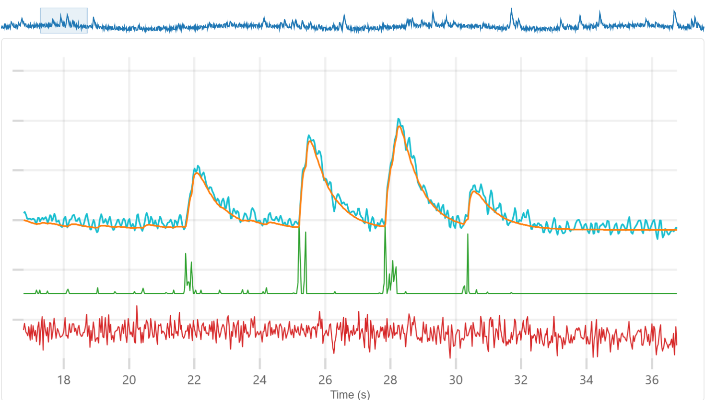
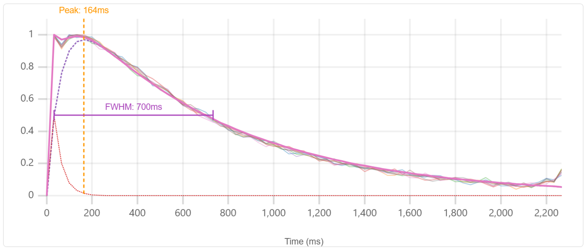

# CaLab

Calcium imaging analysis tools

[](LICENSE)
[](https://github.com/miniscope/CaLab/actions/workflows/ci.yml)
[](https://miniscope.github.io/CaLab/)
[](https://pypi.org/project/calab/)
[](https://calab.readthedocs.io)

## What is CaLab?

CaLab is a suite of tools for calcium imaging deconvolution — recovering neural spiking activity from fluorescence traces. The tools run entirely in the browser (no installation, no server, no data upload) and are backed by a fast FISTA solver written in Rust.

CaLab provides two deconvolution approaches:

- **[CaTune](https://miniscope.github.io/CaLab/CaTune/)** — interactive parameter tuning. You choose the deconvolution parameters (rise time, decay time, sparsity) while watching the solver update in real time, then export them for batch processing.
- **[CaDecon](https://miniscope.github.io/CaLab/CaDecon/)** — automated deconvolution. Estimates the calcium kernel and deconvolution parameters directly from your data using the InDeCa algorithm — no manual tuning needed.

A companion **[Python package](https://calab.readthedocs.io)** (`calab`) provides the same solver as a native Python extension, plus utilities for loading data from CaImAn and Minian, synthetic trace simulation, and batch processing from scripts.

An optional **community sharing** feature (powered by Supabase) lets users share and browse deconvolution parameters across datasets and indicators.

|                                                  |                                                    |
| ------------------------------------------------ | -------------------------------------------------- |
|  |  |
| **CaTune** — interactive parameter tuning        | **CaDecon** — automated deconvolution              |

## Quick Start

### Browser (no install)

1. Open **[CaTune](https://miniscope.github.io/CaLab/CaTune/)** or **[CaDecon](https://miniscope.github.io/CaLab/CaDecon/)** in your browser
2. Try the built-in demo data to explore the interface
3. Drag and drop your own `.npy` or `.npz` file containing calcium traces
4. **CaTune:** adjust parameters with the sliders, then export as JSON
5. **CaDecon:** configure and run — results are computed automatically

### Python

```bash
pip install calab
```

```python
import numpy as np
import calab

traces = np.load("my_traces.npy")

# CaTune: interactive tuning in the browser
params = calab.tune(traces, fs=30.0)

# CaDecon: automated deconvolution
result = calab.decon(traces, fs=30.0, autorun=True)

# Batch deconvolution with known parameters
activity = calab.run_deconvolution(traces, fs=30.0, tau_r=0.02, tau_d=0.4, lam=0.5)
```

See the **[Python documentation](https://calab.readthedocs.io)** for the full API, guides, and CLI reference.

## Apps

| App                                                   | Description                                    | Status      |
| ----------------------------------------------------- | ---------------------------------------------- | ----------- |
| [CaTune](https://miniscope.github.io/CaLab/CaTune/)   | Interactive deconvolution parameter tuning     | Stable      |
| [CaDecon](https://miniscope.github.io/CaLab/CaDecon/) | Automated deconvolution with kernel estimation | Stable      |
| [CaRank](apps/carank/)                                | Trace quality ranking                          | Coming soon |

## Python Package

The `calab` Python package runs the same Rust FISTA solver (compiled to a native extension via PyO3) and provides:

- **CaTune workflow** — `tune()` for interactive parameter selection, `run_deconvolution()` for batch processing
- **CaDecon workflow** — `decon()` for automated deconvolution, with headless mode for scripting/CI
- **Data loaders** — load traces from CaImAn (HDF5) and Minian (Zarr) pipelines
- **Simulation** — generate synthetic traces with ground truth for benchmarking
- **CLI** — `calab tune`, `calab cadecon`, `calab deconvolve`, `calab convert`, `calab info`

```bash
pip install calab                # core package
pip install calab[loaders]       # + CaImAn/Minian support
pip install calab[headless]      # + headless browser for CaDecon
```

> **Full documentation:** [calab.readthedocs.io](https://calab.readthedocs.io)

## Monorepo Structure

```
.
├── apps/
│   ├── catune/                  # SolidJS SPA — interactive parameter tuning
│   ├── cadecon/                 # SolidJS SPA — automated deconvolution
│   └── carank/                  # SolidJS SPA — trace quality ranking
├── packages/
│   ├── core/                    # @calab/core — shared types, pure math, WASM adapter
│   ├── compute/                 # @calab/compute — worker pool, warm-start cache
│   ├── io/                      # @calab/io — file parsers, validation, export
│   ├── community/               # @calab/community — Supabase DAL, submission logic
│   ├── tutorials/               # @calab/tutorials — tutorial types, progress persistence
│   └── ui/                      # @calab/ui — shared layout components
├── crates/
│   └── solver/                  # Rust FISTA solver crate (WASM + PyO3)
├── python/                      # Python companion package
├── docs/                        # Documentation
├── scripts/                     # Build and deploy scripts
└── supabase/                    # Supabase config
```

## Packages

| Package                                   | Description                                                          |
| ----------------------------------------- | -------------------------------------------------------------------- |
| [`@calab/core`](packages/core/)           | Shared types, pure utilities, domain math, WASM adapter              |
| [`@calab/compute`](packages/compute/)     | Generic worker pool, warm-start caching, kernel math, downsampling   |
| [`@calab/io`](packages/io/)               | File parsers (.npy/.npz), data validation, cell ranking, JSON export |
| [`@calab/community`](packages/community/) | Supabase data access layer for community parameter sharing           |
| [`@calab/tutorials`](packages/tutorials/) | Tutorial type definitions, progress persistence (localStorage)       |
| [`@calab/ui`](packages/ui/)               | Shared SolidJS layout components (DashboardShell, panels, cards)     |

## Development

### Prerequisites

- **Node.js 22** (LTS) — use `.nvmrc`: `nvm use`
- **Rust stable** + **wasm-pack** — only needed if modifying the solver
- **Python >= 3.10** — only needed for the Python package

### Setup

```bash
git clone https://github.com/miniscope/CaLab.git
cd CaLab
nvm use
npm install
npm run dev
```

### Key Scripts

| Script                | Description                            |
| --------------------- | -------------------------------------- |
| `npm run dev`         | Start dev server                       |
| `npm run build`       | Build WASM + all apps                  |
| `npm run build:pages` | Build + combine dist for GitHub Pages  |
| `npm run build:wasm`  | Compile Rust solver to WASM            |
| `npm run test`        | Run Vitest tests across all workspaces |
| `npm run lint`        | Run ESLint                             |
| `npm run typecheck`   | Run TypeScript type checking           |
| `npm run format`      | Format all files with Prettier         |

See [`docs/CONTRIBUTING.md`](docs/CONTRIBUTING.md) for the full development guide.

## Documentation

- **[Python Package (ReadTheDocs)](https://calab.readthedocs.io)** — API reference, guides, CLI
- [Architecture](docs/ARCHITECTURE.md) — module layout, dependency DAG, state management, boundaries
- [Contributing](docs/CONTRIBUTING.md) — setup, scripts, code style, CI
- [Changelog](docs/CHANGELOG.md) — release history
- [New App Guide](docs/NEW_APP.md) — adding a new app to the monorepo
- [WASM Solver](crates/solver/README.md) — Rust FISTA solver documentation

## Tech Stack

- **Frontend:** SolidJS + TypeScript + Vite
- **Solver:** Rust → WebAssembly (browser) + PyO3 (Python)
- **Charts:** uPlot
- **Community:** Supabase (optional)
- **Styling:** Pure CSS with custom properties

## Versioning

The monorepo uses a single `v*` tag for all web apps and packages (e.g., `v2.0.6`). The Python package has a separate `py/v*` tag series. See the [Changelog](docs/CHANGELOG.md) for release history.

## License

[MIT](LICENSE) — Copyright (c) 2025 Daniel Aharoni

## Contributing

Contributions are welcome! See [`docs/CONTRIBUTING.md`](docs/CONTRIBUTING.md) for setup instructions, code style guidelines, and the CI pipeline. Bug reports and feature requests can be filed via [GitHub Issues](https://github.com/miniscope/CaLab/issues).
