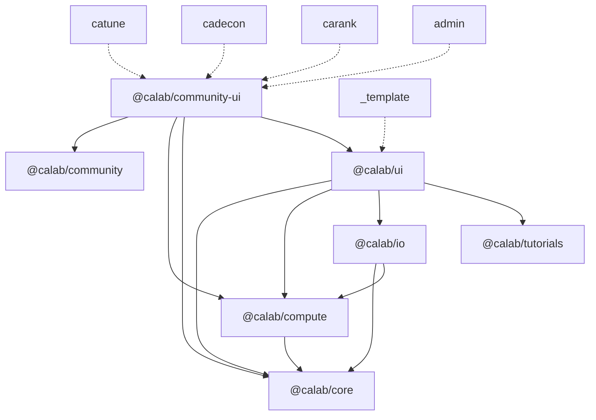

# CaLab Architecture

> For a project overview, quick start, and documentation index, see the [root README](../README.md).
> To add an app, follow [NEW_APP.md](NEW_APP.md).

CaLab is a monorepo of calcium imaging analysis tools: SolidJS + TypeScript web apps
built with Vite, a Rust solver compiled to WebAssembly for the browser and to a
native extension for the `calab` Python package, and a Supabase backend for
community sharing and usage analytics.

## Monorepo Structure

npm workspaces cover `apps/*` and `packages/*` (root `package.json`). There are
eight packages and five app directories: four apps (`catune`, `cadecon`, `carank`,
`admin`) and `apps/_template`, the starting point for a new app. The build
scripts skip `_template`. The tree shows the shape of each area rather than every
file.

```
.
├── apps/
│   ├── catune/                    # CaTune: interactive FISTA deconvolution tuning
│   │   ├── src/
│   │   │   ├── index.tsx          # Start-up (see "App Anatomy")
│   │   │   ├── App.tsx
│   │   │   ├── components/        # auth, cards, community, controls, layout,
│   │   │   │                      # metrics, spectrum, traces, tutorial
│   │   │   ├── lib/               # Signals and wiring: data-store, viz-store,
│   │   │   │                      # multi-cell-store, cell-solve-manager,
│   │   │   │                      # catune-pool, export, export-schema,
│   │   │   │                      # spectrum/, community/, tutorial/, chart/
│   │   │   ├── workers/           # pool-worker.ts + catune-types.ts (protocol)
│   │   │   └── styles/
│   │   ├── vite.config.ts         # defineCalabApp(import.meta.dirname, { wasm: true })
│   │   ├── tsconfig.json          # { "extends": "../../tsconfig.app.json" }
│   │   └── package.json           # deps + `calab` metadata block
│   ├── cadecon/                   # CaDecon: automated InDeCa deconvolution
│   │   └── src/                   # same shape; lib/ has algorithm-, iteration-,
│   │                              # subset-, viz-store, iteration-manager,
│   │                              # cadecon-pool, bridge-effects; workers/
│   │                              # has cadecon-worker.ts + cadecon-types.ts
│   ├── carank/                    # CaRank: trace quality ranking (no solver)
│   ├── admin/                     # Admin: analytics + moderation (hidden app)
│   └── _template/                 # Minimal app scaffold (placeholder calab.id)
├── packages/
│   ├── core/                      # @calab/core      types, pure math; ./wasm entry
│   ├── compute/                   # @calab/compute   worker pool, kernel math, sims
│   ├── io/                        # @calab/io        parsers, import store, bridge
│   ├── community/                 # @calab/community Supabase, auth, analytics
│   ├── community-ui/              # @calab/community-ui  community/auth widgets
│   ├── tutorials/                 # @calab/tutorials driver.js engine + progress
│   ├── ui/                        # @calab/ui        layout, charts, import flow, CSS
│   └── vite-config/               # @calab/vite-config  defineCalabApp, __APP_ID__
├── crates/solver/                 # Rust solver (wasm-bindgen + PyO3)
│   ├── src/                       # lib.rs, validate.rs, fista.rs, indeca.rs, ...
│   ├── tests/                     # solver_degenerate.rs, solver_proptest.rs
│   └── pkg/                       # wasm-pack output (build-only, gitignored)
├── python/                        # `calab` package (maturin), tests, docs
│   └── src/calab/_bridge/         # registry, manifest, handshake, HTTP server
├── supabase/                      # migrations/, functions/geo-session/,
│                                  # tests/rls/, seed/
├── e2e/                           # Playwright smoke specs + build/serve helpers
├── scripts/
│   ├── lib/apps.mjs               # App discovery + apps.json manifest shape
│   ├── dev.mjs                    # npm run dev [app]
│   ├── build-apps.mjs             # Build every app with a build script
│   ├── combine-dist.mjs           # Landing page + apps.json + app dists
│   ├── check-apps-manifest.mjs    # Verify dist/<repo>/apps.json
│   ├── check-app-tests.mjs        # Every app has a test script
│   ├── ensure-wasm.mjs            # Build crates/solver/pkg if missing/stale
│   ├── typecheck.mjs              # tsc over every app and package
│   └── test-rls.sh                # Supabase RLS policy matrix
├── docs/                          # ARCHITECTURE, CHANGELOG, CONTRIBUTING, NEW_APP
├── .github/workflows/             # ci.yml, deploy.yml, publish-python.yml
├── tsconfig.base.json             # Shared compiler options
├── tsconfig.app.json              # Shared app tsconfig (adds __APP_ID__ type)
├── vitest.config.ts               # Root coverage run + per-package floors
├── playwright.config.ts           # e2e config
└── eslint.config.js               # Lint rules incl. import boundaries
```

## Dependency DAG

Every `@calab/*` package points `main`/`exports` at its TypeScript source, so Vite
and `tsc` resolve the workspace symlinks directly: there are no `resolve.alias`
entries or tsconfig `paths`. The edges below are the `@calab/*` entries in each
`package.json` `dependencies` (apps also have `@calab/vite-config` as a
devDependency, used only by `vite.config.ts`). To keep the diagram readable, each
app (dashed) is drawn with one edge to its top-most package; the table lists every
direct dependency.



| Package / app         | `@calab/*` dependencies                                     | Notable external deps                      |
| --------------------- | ----------------------------------------------------------- | ------------------------------------------ |
| `@calab/core`         | none                                                        | `valibot`                                  |
| `@calab/compute`      | core                                                        | none                                       |
| `@calab/io`           | core, compute                                               | `fflate`, `solid-js`, `valibot`            |
| `@calab/tutorials`    | none                                                        | `driver.js`, `solid-js`                    |
| `@calab/community`    | none                                                        | `@supabase/supabase-js`, `solid-js` (peer) |
| `@calab/ui`           | core, compute, io (only from `@calab/ui/import`), tutorials | `solid-js`, `uplot`, `@dschz/solid-uplot`  |
| `@calab/community-ui` | community, compute, core, ui                                | `solid-js`, `uplot`                        |
| `@calab/vite-config`  | none (uses the root `vite`/`vitest`/plugin devDependencies) | none                                       |
| `apps/catune`         | all seven runtime packages                                  | `uplot`, `@dschz/solid-uplot`, `valibot`   |
| `apps/cadecon`        | all seven runtime packages                                  | `uplot`, `@dschz/solid-uplot`              |
| `apps/carank`         | core, io, tutorials, community, community-ui, ui            | none                                       |
| `apps/admin`          | community, community-ui, ui                                 | none                                       |
| `apps/_template`      | core, io, tutorials, ui                                     | none                                       |

### Boundary rules

All boundaries are enforced by ESLint's core `no-restricted-imports` rule, configured
in blocks in `eslint.config.js`. Flat config applies only the last matching block's
`no-restricted-imports`, so the narrower blocks repeat the shared `BOUNDARY_PATTERNS`.

| Rule                                                                                                           | Where it is configured                                                                             |
| -------------------------------------------------------------------------------------------------------------- | -------------------------------------------------------------------------------------------------- |
| No direct imports of the wasm-pack output (`**/crates/solver/pkg/*`); use `@calab/core/wasm`                   | `BOUNDARY_PATTERNS`, all of `apps/**` and `packages/**` except `packages/core/src/wasm-adapter.ts` |
| `@supabase/supabase-js` is imported only inside `@calab/community`                                             | `BOUNDARY_PATTERNS`; exempt: `packages/community/src/{supabase,auth,submission-service}.ts`        |
| No reaching into another package's source (`@calab/*/src/*`); import the package entry                         | `BOUNDARY_PATTERNS`                                                                                |
| `@calab/ui` must not import `@calab/community` or `@calab/community-ui` (or their subpaths)                    | `packages/ui/**` block                                                                             |
| The `@calab/core` barrel stays wasm-free: only `src/wasm.ts` / `src/wasm-adapter.ts` may reach the solver glue | `packages/core/src/**` block (tests exempt)                                                        |

Not lint-enforced, but held by `package.json`: `@calab/core`, `@calab/community`
and `@calab/tutorials` have no `@calab/*` dependencies, and nothing depends on an app.

## Package Responsibilities

Packages export plain logic, components and factories; each app wires them to its
own SolidJS signals.

**`@calab/core`** (`.` and `./wasm`). The `.` entry is wasm-free: shared types
(`NpyResult`, `ValidationResult`, `ImportStep`, and the app-side `DataSource`,
one of `'file'`, `'demo'`, `'bridge'`), solver input types (`SolverParams`, `ConvMode`,
`WarmStartStrategy`), `computeAR2`, `PARAM_RANGES` / `CONVERGENCE_RANGES`,
`computePeakSNR`, the solver metrics and `computePeriodogram`. `@calab/core/wasm`
(`src/wasm.ts` → `src/wasm-adapter.ts`) is the only route to the solver: `initWasm`,
`Solver`, the `indeca_*` functions, `seed_trace`, `simulate_traces`,
`get_simulation_presets`, `solver_version` and `getSolverVersion()` (inits WASM,
returns the version, or `undefined` if WASM fails to load). Keeping the solver out
of the barrel is what lets CaRank ship without the `.wasm` asset.

**`@calab/compute`**. `createWorkerPool` (see [Solver Pipeline](#solver-pipeline))
and its sizing helpers (`resolveWorkerCount`, `getWorkersOverride` for the
`?workers=N` URL override, `getDefaultWorkerCount`); `WarmStartCache` with
`computePaddedWindow` / `computeSafeMargin`; kernel math (`computeKernel`,
`tauToShape` / `shapeToTau`, `kernelShapeRmse`); `downsampleMinMax`; the residual
band helpers `computeBandLayout`, `scaleToBand`, `residualBandSeries`; and the
simulation presets and types (`buildSimulationConfig`, `SimulationConfig`, ...).

**`@calab/io`**. Parsers and writers for `.npy` (`parseNpy`, `writeNpy`), `.npz`
(`parseNpz`) and MATLAB `.mat` (`parseMat`, `writeMat`); `.npz`/`.mat` decompression
is capped at `DEFAULT_MAX_DECOMPRESSED_BYTES` (1 GiB) and throws
`DecompressedSizeLimitError` above it. Validation (`validateTraceData`,
`validateParsedData`), array helpers, `traceCandidates`, `rankCellsByActivity`.
`createImportStore({ appName, simulate, ... })` is the reactive import flow (file,
array selection, dimensions, sampling rate, demo data, bridge loading,
`dataSource`); `simulate` is injected so `@calab/io` never imports the WASM glue.
`bridge.ts` is the browser side of the Python bridge (`getBridgeUrl`,
`fetchBridgeData`, `postParamsToBridge`, `postResultsToBridge`, heartbeat).

**`@calab/community`**. The only package that talks to Supabase. `getSupabase()`
lazily `import()`s the SDK; `supabaseEnabled` is false when the `VITE_SUPABASE_*`
env vars are unset, and the apps then run with community features off. Exports
auth (`subscribeAuth`, `signInWithEmail`, `signOut`), `createSubmissionService`,
field options, `computeDatasetHash`, GitHub issue URL builders, analytics
(`initSession`, `trackEvent`), and the lazy community store (`initCommunityStore`,
`user`, `authLoading`, `fieldOptions`, `loadFieldOptions`). Its `DataSource`
(`'user' | 'demo' | 'bridge' | 'training'`) is the stored vocabulary.

**`@calab/community-ui`**. SolidJS components coupled to the community backend,
split out so an app can use `@calab/ui` without loading auth code: `AuthGate`,
`AuthCallback`, `AuthMenuWrapper` / `CommunityAuthMenu`, `isAuthCallback`,
`CommunityBrowserShell`, `FilterBar`, `SubmitForm` + `createSubmitFormFields`,
`SubmitFormModal`, `SubmissionSummary`, `CommunityScatterPlot`,
`GroundTruthControls`, `FeedbackMenu` / `ImportFeedbackLinks`, and the payload
helpers `buildBaseSubmissionPayload`, `hashSubmissionDataset`,
`parseOptionalNumber` and `toCommunityDataSource` (the one mapping from the app
`DataSource` to the stored one; `'file'` → `'user'`).

**`@calab/tutorials`**. The tutorial engine on driver.js (`startTutorial`,
`stopTutorial`, `configureTutorialEngine`, `notifyTutorialAction`), its signals
(`activeTutorial`, `isTutorialActive`, ...) and localStorage progress
(`configureStorageKey`, `saveProgress`, `isCompleted`). Tutorial content lives in
each app.

**`@calab/ui`**. Backend-free shell. `.`: `DashboardShell`, `DashboardPanel`,
`VizLayout`, `CompactHeader`, `Card` / `CardGrid`, `TutorialPanel` /
`TutorialLauncher`, `WorkerIndicator`, `SimulationConfigurator`, `TraceLegend`, and
chart re-exports. `@calab/ui/chart`: uPlot plugins and helpers (`wheelZoomPlugin`,
`chartAxis`, `syncCursor`, the Okabe-Ito palette, viridis colormap), `TracePanel`,
`TraceOverview`, `ZoomWindow`. `@calab/ui/import`: the import flow components
(`ImportOverlay`, `FileDropZone`, `NpzArraySelector`, `DimensionConfirmation`,
`SamplingRateInput`, `DataValidationReport`, `TracePreview`), each taking an
`ImportStore`; a separate entry so apps without an import flow never load
`@calab/io`. `@calab/ui/styles/*`: tokens and shared CSS (see
[CSS Conventions](#css-conventions)).

**`@calab/vite-config`**. `defineCalabApp(appDir, { wasm?, vite? })` returns an
app's whole Vite + Vitest config: GitHub Pages `base` (`appBase`), `envDir`, the
Solid plugin, `vite-plugin-wasm` on the main and worker builds when `wasm: true`
(never under Vitest), the jsdom test environment, and the `__APP_ID__` define.
`readAppIdentity` validates `calab.id` against `APP_ID_PATTERN`. `client.d.ts`
declares `__APP_ID__`; the root `tsconfig.app.json` includes it for every app.

## App Anatomy

**Identity.** Each app's `package.json` has a `calab` block (`id`, `displayName`,
`description`, `longDescription`, `features`, `status`, `screenshot`, optional
`hidden`). `calab.id` is the single app identity: `defineCalabApp` checks it
against `^[a-z][a-z0-9_-]{1,31}$` and injects it as the build-time global
`__APP_ID__`, which the app passes to `initSession` (analytics `app_name`),
`FeedbackMenu` and `SubmitForm` (GitHub issue labels). The same regex is the
`analytics_sessions_app_name_slug_check` constraint
(`supabase/migrations/015_app_name_slug_check.sql`) and `APP_NAME_PATTERN` in the
`geo-session` edge function, which returns 400 on a malformed name. A new app
needs no migration or edge-function change.

**What the `calab` block drives.** `scripts/lib/apps.mjs` discovers apps from
`apps/*/package.json` (skipping `_template`) and is shared by `scripts/dev.mjs`
(`npm run dev [app]`, matching directory, id or display name),
`scripts/combine-dist.mjs` and `scripts/check-apps-manifest.mjs`. combine-dist
copies each app's `dist/` to `dist/<repo>/<displayName>/`, renders the landing
page from the metadata (non-hidden apps, ordered stable → beta → coming-soon), and
writes `dist/<repo>/apps.json` (`manifest_version`, `release`, `commit`,
`generated_at`, and `id` / `displayName` / `path` / `description` / `status` per
non-hidden app). The Python bridge reads that manifest from the deployed site (see
[python/docs/guides/bridge.md](../python/docs/guides/bridge.md)).

**Start-up.** `index.tsx` in CaTune, CaDecon and CaRank follows one sequence:

1. Import `@calab/ui/styles/base.css` (plus `tutorial.css`, and for CaTune/CaDecon
   `theory-figures.css` and `app-global.css`), then the app's own styles.
2. `configureStorageKey(...)` for tutorial progress (CaTune/CaDecon also
   `configureTutorialEngine(...)`).
3. `initCommunityStore()`, starting the app's single auth subscription before the
   first render.
4. `render(() => <App />, ...)`.
5. `void initSession(__APP_ID__, import.meta.env.VITE_APP_VERSION || 'dev')`, and
   for CaTune/CaDecon `setupAnalyticsEffects()`.

Admin calls only `initCommunityStore()` and `render`; `_template` only renders.

**Placement rule.** Code that only one app uses lives in that app: worker
protocols (`workers/catune-types.ts`, `workers/cadecon-types.ts`), pool routers
(`lib/catune-pool.ts`, `lib/cadecon-pool.ts`), result payloads and schemas
(`apps/catune/src/lib/export.ts` / `export-schema.ts`,
`apps/cadecon/src/lib/export-utils.ts`). Shared packages keep app-neutral
algorithms, components and the transport the apps share.

## State Management

There are no Context providers. State is module-level SolidJS primitives
(`createSignal`, `createMemo`, and `createStore` for per-cell data in CaTune)
exported from `lib/*.ts`, so components and
non-component code (the tutorial engine, the solve managers) read the same state.

- **CaTune**: `data-store.ts` is a `createImportStore()` instance whose members are
  re-exported; `viz-store.ts` (view state), `multi-cell-store.ts` (selected cells,
  per-cell results and solver status), `spectrum/spectrum-store.ts`, and
  `cell-solve-manager.ts`, which owns the worker pool and warm-start cache.
- **CaDecon**: `data-store.ts` (also `createImportStore()`), `algorithm-store.ts`,
  `iteration-store.ts`, `subset-store.ts`, `viz-store.ts`, and
  `iteration-manager.ts`, which owns the pool and runs the iteration loop.
- **CaRank / Admin**: `carank/src/lib/auth-store.ts` and `admin/src/lib/admin-store.ts`
  re-export the community store's `user` / `authLoading`; Admin adds its own
  signals.
- **Shared**: the community store in `@calab/community` is side-effect free on
  import; `initCommunityStore()` (idempotent, also triggered by the first
  `user()` / `authLoading()` read) starts one auth subscription per app. Tutorial
  state lives in `@calab/tutorials`.

## Solver Pipeline

**Crate.** `crates/solver` (`calab-solver`) has two feature sets:
`jsbindings` (default; wasm-bindgen) and `pybindings` (PyO3 with `abi3-py311`, one
wheel per platform for CPython ≥ 3.11). `npm run build:wasm` runs
`wasm-pack build --target web --release` into `crates/solver/pkg/`, which is
build-only and gitignored (`scripts/ensure-wasm.mjs` builds it before `dev`,
`build:apps`, `test` and `typecheck`). maturin builds `calab._solver` with
`--features pybindings`.

**Version.** `SOLVER_VERSION` in `lib.rs` is `CARGO_PKG_VERSION`, i.e. `version`
in `Cargo.toml`. It is exported as `solver_version()` to WASM and as
`calab._solver.__version__` / `calab._solver.protocol_version()` to Python; Rust
tests pin it to Cargo.toml.

**Validation.** `src/validate.rs` holds every check that guards a public entry
point, shared by both bindings, `simulate_traces` included
(`validate_simulation_config`). Bad input throws a `JsError` in JS and raises
`ValueError` in Python (numerical failures `RuntimeError`) instead of trapping the
WASM module or aborting the interpreter. `packages/core/src/__tests__/wasm-parity.test.ts`
loads the real `pkg/` build and checks it reproduces the native golden fixtures
in `python/tests/fixtures/`.

**In the browser.**

```
param change (CaTune) / run step (CaDecon)
  → cell-solve-manager / iteration-manager builds a job
  → createWorkerPool (@calab/compute) dispatches it to an idle worker, or queues it
  → app worker (catune pool-worker.ts / cadecon-worker.ts)
      → initWasm() from @calab/core/wasm; posts { type: 'ready' } or { type: 'init-error' }
      → runs the solver; CaTune yields via MessageChannel and posts intermediates every ~100 ms
  → the app's MessageRouter (catune-pool.ts / cadecon-pool.ts) routes results to the job
```

`createWorkerPool(createWorker, router, poolSize?, { onFatal })` takes a worker
factory so the `new Worker(new URL(..., import.meta.url))` call stays in the app
where Vite can bundle it. Pool size defaults to `resolveWorkerCount()`
(`?workers=N`, else cores − 1 clamped to 2..8). Every dispatched job settles exactly
once. A worker that fails before reporting ready is marked dead and not respawned
(init failures are deterministic); one that fails after ready is replaced once per
slot. When every worker is dead the pool is fatal: queued jobs fail, later
dispatches fail immediately, and `onFatal` fires once (both apps surface a
"solver workers failed" error). `dispose()` cancels everything.

Design choices: raw `postMessage` (not Comlink) so cancel messages are handled
between solver batches; MessageChannel yields (<1 ms) rather than `setTimeout(0)`;
`WarmStartCache` picks `warm` (only λ changed, same kernel), `warm-no-momentum`
(τ changed by under 20%) or `cold` for each solve, keyed on the padded window.

**In Python.** `calab.tune()` / `calab.decon()` open the web app against a
localhost bridge server (`python/src/calab/_bridge/`). The registry
(`_registry.py`) holds one `AppSpec` per slug; results arrive at
`POST /api/v1/results/{app}`; `_handshake.py` checks `schema_version` (required)
and `solver_version` (optional) with Cargo caret rules and raises
`BridgeVersionError` or warns with `BridgeVersionWarning`. Details:
[python/docs/guides/bridge.md](../python/docs/guides/bridge.md).

## Module Boundaries

### WASM Adapter Rule

Only `packages/core/src/wasm-adapter.ts` imports from `crates/solver/pkg/`. Everything
else imports from `@calab/core/wasm`; the `@calab/core` barrel is wasm-free. Both are
`no-restricted-imports` rules (see [Boundary rules](#boundary-rules)).

### Supabase Isolation

`@supabase/supabase-js` is imported only in `packages/community/src/supabase.ts`
(a dynamic `import()`, so the SDK loads on first use) and as types in `auth.ts` and
`submission-service.ts`. `@calab/ui` may not import the community packages at all.

### Package Barrel Rule

Import a package through its `exports` entries (`@calab/core`, `@calab/core/wasm`,
`@calab/ui/chart`, `@calab/ui/import`, ...), never `@calab/<pkg>/src/...`.

### App Barrels

`lib/community/index.ts` in CaTune and CaDecon re-exports what the app uses from
`@calab/community` alongside the app's own submission service and checks;
components import from it.

## Testing & CI

| Layer         | What                                                                                                                                                                                      | Command                                                  |
| ------------- | ----------------------------------------------------------------------------------------------------------------------------------------------------------------------------------------- | -------------------------------------------------------- |
| Unit (TS)     | Vitest per workspace (apps configure it in `vite.config.ts`, packages in `vitest.config.ts`); WASM parity and degenerate-input tests in `packages/core` run against the real `pkg/` build | `npm test`                                               |
| Coverage      | Root `vitest.config.ts` runs every workspace as a project; per-package floors for core, io, compute, community, ui, community-ui (apps and tutorials reported only)                       | `npm run test:coverage`                                  |
| Rust          | Unit tests, `tests/solver_degenerate.rs`, `tests/solver_proptest.rs`, `src/degenerate_tests/ffi_surface.rs`, version tests; clippy for both feature sets                                  | `cargo test --no-default-features --features jsbindings` |
| Python        | pytest incl. `test_degenerate_inputs.py`, `test_bridge_registry.py`, `test_bridge_manifest.py`, `test_bridge.py` (handshake); ruff, mypy                                                  | `pytest -m "not integration"`                            |
| Database      | RLS policy matrix (`supabase/tests/rls/`) on Postgres 16 (a Docker container locally unless `PGHOST` is set; a service container in CI)                                                   | `./scripts/test-rls.sh`                                  |
| Edge function | Deno tests for `geo-session`                                                                                                                                                              | `deno test ... index.test.ts`                            |
| Browser smoke | Playwright, Chromium, against the production build of the combined site                                                                                                                   | `npm run build:e2e && npm run test:e2e`                  |

**Browser smoke (`e2e/`).** Every test fails on any `console.error` (including in
workers), page error, same-origin 4xx/5xx, or request to another host. Per spec:
`catune.spec.ts` loads demo data and waits for every visible card to show a solved
`SNR x.x` label; `cadecon.spec.ts` generates data, runs to "Complete" and checks
the raster canvas is painted; `carank.spec.ts` imports an in-memory `.npy` and
checks the ranking table; `admin.spec.ts` checks the auth guard blocks the
dashboard without Supabase; `landing.spec.ts` checks one card per non-hidden app
and that `apps.json` matches the cards. See [e2e/README.md](../e2e/README.md).

**CI (`.github/workflows/ci.yml`, every PR and push to main).**

- `check`: build WASM, format check, lint, typecheck, `check:app-tests`, tests,
  coverage (uploads `coverage-lcov`), `build:apps`, then `combine-dist` +
  `check:apps-manifest`.
- `e2e`: build WASM, `build:e2e`, `typecheck:e2e`, `test:e2e`.
- `rust`: `cargo fmt --all --check`, clippy (`jsbindings` and `pybindings`, `--all-targets`),
  `cargo test`.
- `python`: maturin develop, ruff, mypy, pytest on Python 3.11, 3.12 and 3.13.
- `supabase`: migrations + RLS matrix, then the Deno edge-function tests.

**Deploy (`deploy.yml`, `v*` tags or manual).** `deploy` needs `check` (format,
lint, typecheck, app-test check, tests), `rust`, `python`, `supabase` and `e2e`,
mirrors of the CI jobs. It then runs `npm run build:pages` (build, `combine-dist`,
`check-apps-manifest`) and uploads `dist/<repository name>` to GitHub Pages.

**Python release (`publish-python.yml`, `py/v*` tags).** `test` and `rust` gate
wheel and sdist builds; wheels are smoke-tested before `publish` to PyPI.

## CSS Conventions

- Plain CSS with custom properties; no CSS-in-JS.
- Design tokens in `packages/ui/src/styles/tokens.css`, pulled in by
  `@calab/ui/styles/base.css` with the reset, buttons, layout and header styles.
- Rules shared by CaTune and CaDecon live in `@calab/ui/styles/app-global.css` and
  `app-controls.css`; each app's `styles/` keeps only its own rules and overrides.
  Community widgets bring their CSS from `packages/community-ui/src/styles/`.
- `DashboardPanel` sets `data-panel-id` for layout targeting.
